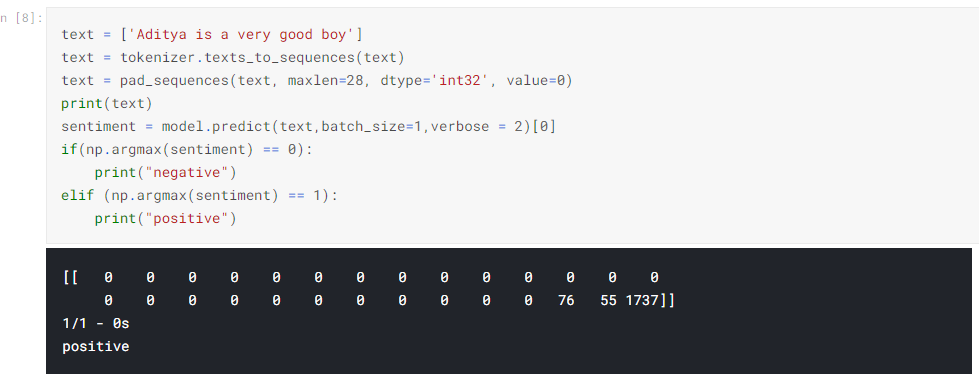

# TwitterSentimentAnalysis
Sentiment analysis (text mining and opinion mining) uses Natural Language Processing to determine whether data is positive, negative or neutral. Sentiment analysis is often performed on textual data to help businesses monitor brand and product sentiment in customer feedback, and understand customer needs. Sentiment Analysis is used by big MNCs to increase the revenue by analysing the user reviews. The first step is to clean the textual data and tokenize it. The should remove the stopwords(frequent words). I experimented with the following networks, Long Short Term Memory, Recurrent neural networks, Gated Recurrent Units, Bidirectional RNN/LSTM then finally settled with the Bidirectional GRU. One epoch took 900 seconds so I only trained for two epochs(resource constraint).A Bidirectional GRU, or BiGRU, is a sequence processing model that consists of two GRUs. one taking the input in a forward direction, and the other in a backwards direction. It is a bidirectional recurrent neural network with only the input and forget gates. Using bidirectional GRU is computationally expensive.

# Output 

